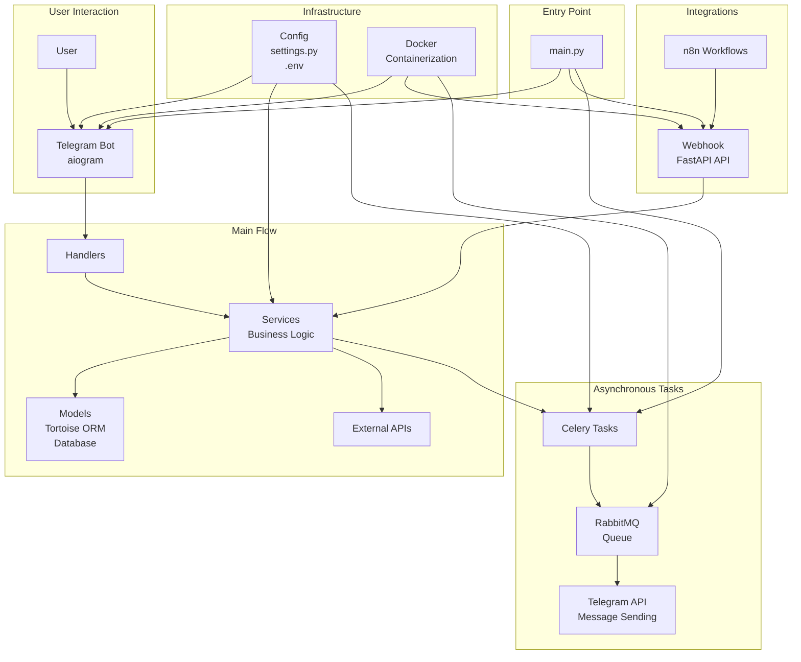

# telegram-n8n-bot

> **Attention:** The project is under active development.

## Description

This repository implements a Telegram bot integrated with n8n automations. The project architecture is focused on modularity and maintainability. FastAPI is used for the API, and the bot logic, handlers, models, and services are separated into individual modules.

> **Note:** The chatbot is designed for Russian-speaking users. All documentation is in English, but the bot's functionality and interface are in Russian.

## Project Stack
- **Language:** [Python 3.13+](https://www.python.org/)
- **API Framework:** [FastAPI](https://fastapi.tiangolo.com/)
- **Telegram Bot:** [aiogram](https://docs.aiogram.dev/)
- **ORM:** [Tortoise ORM](https://tortoise.github.io/toc.html)
- **Migrations:** [Aerich](https://tortoise.github.io/migration.html?h=aerich#)
- **Automations:** [n8n](https://n8n.io/) (integration via the service layer)
- **Message Broker & Task Queue:** [RabbitMQ](https://www.rabbitmq.com/) + [Celery](https://docs.celeryq.dev/en/stable/)
- **Containerization:** [Docker](https://www.docker.com/), [docker-compose](https://docs.docker.com/compose/)
- **Dependency Management:** [requirements.txt](https://pip.pypa.io/en/stable/user_guide/#requirements-files)
- **Configuration:** [pydantic-settings](https://docs.pydantic.dev/latest/integrations/pydantic_settings/), [.env](https://12factor.net/config)
- **Logging:** standard [logging](https://docs.python.org/3/library/logging.html) with file rotation
- **Command Management:** [Makefile](https://www.gnu.org/software/make/manual/make.html)

## Architecture and Main Components

- **main.py** — application entry point, initialization, and integration of all components.
- **app/** — main application logic:
    - `api_fastapi/` — FastAPI endpoints and related logic.
    - `bot_telegram/` — Telegram bot implementation (`bot.py`), logging, and utilities.
    - `celery_tasks/` — Celery tasks for asynchronous message sending in Telegram and bulk messaging. Contains task queue implementations, Telegram API error handling (such as rate limits), and examples of using Celery with aiogram. Used for RabbitMQ integration and managing background message delivery tasks.
    - `handlers/` — bot command and message handlers.
    - `models/` — data models (e.g., `user.py`).
    - `services/` — business logic and integrations (n8n, external APIs).
    - `utils/` — helper functions.
    - `decorators/` — custom decorators (e.g., for authentication, logging).
- **celery_app.py** — Celery application configuration and initialization. Sets up the message broker (RabbitMQ), result backend, serialization options, and imports Celery tasks for asynchronous processing (such as sending Telegram messages).
- **config/** — configuration management (`settings.py` for environment variables).
- **Dockerfile** and **docker-compose.yml** — containerization and orchestration for development and deployment.

## Architecture Diagram



## Quick Start

1. Make sure you have [Docker](https://www.docker.com/get-started) installed on your machine.
2. Clone the repository:
    ```sh
    git clone https://github.com/VMSTR8/telegramBot_n8n.git
    cd telegramBot_n8n
    ```
3. Create a `.env` file based on the `env.example` template:
    ```sh
    make env
    ```
4. Fill in the required environment variables in `.env`:
    ```sh
    vi .env
    ```
5. Start the project using Docker:
    ```sh
    make dev-up
    ```

> You can view all available commands using **make help**

## Main Patterns

- **Modular structure:** The project is organized by responsibility: API endpoints (`app/api_fastapi/`), Telegram bot core (`app/bot_telegram/`), handlers (`app/handlers/`), services (`app/services/`), decorators (`app/decorators/`), and Celery tasks (`app/celery_tasks/`).
- **Centralized configuration:** All environment variables and settings are managed in `config/settings.py`, using Pydantic for type safety and validation.
- **Bot logic:** The main bot manager and dispatcher setup are in `app/bot_telegram/main.py`. Command and message handlers are grouped in `app/handlers/`.
- **Service layer:** Business logic, integrations (including n8n and external APIs), and message queueing are implemented in `app/services/`.
- **Celery integration:** Asynchronous message sending and bulk messaging are handled in `app/celery_tasks/`, with Celery configuration in `app/celery_app.py`.
- **Reusable decorators:** Custom authentication, validation, and logging decorators are located in `app/decorators/`.
