# telegram-n8n-bot

For the Russian version, see [README_rus.md](README_rus.md).

## Description

Modular Telegram bot with n8n workflow automation for managing surveys, penalties, and user roles. The project is built on a three-layer architecture with clear separation of concerns: event handlers (handlers), business logic (services), and data models (models). Supports both polling mode for development and webhook mode for production using Docker and Traefik for SSL.

> **Note:** The chatbot was created for Russian-speaking users. All documentation is in English, but the chatbot interface is in Russian.

## Technology Stack

### Backend and Bot Framework
- **Bot Framework:** [aiogram 3.22](https://docs.aiogram.dev/en/latest/) - Asynchronous framework for Telegram Bot API
- **Web Framework:** [FastAPI 0.116](https://fastapi.tiangolo.com/) - Modern web framework for Python with automatic documentation
- **Task Queue:** [Celery 5.5](https://docs.celeryq.dev/en/stable/) - Distributed task queue for asynchronous processing

### Database and ORM
- **Database:** [PostgreSQL 15](https://www.postgresql.org/) - Relational database
- **ORM:** [Tortoise ORM 0.25](https://tortoise.github.io/) - Asynchronous ORM for Python
- **Migrations:** [Aerich 0.9](https://github.com/tortoise/aerich) - Migration tool for Tortoise ORM

### Infrastructure and Integrations
- **Message Broker:** [RabbitMQ 3](https://www.rabbitmq.com/) - Message broker for Celery
- **Workflow Automation:** [n8n](https://n8n.io/) - Workflow automation platform
- **Reverse Proxy:** [Traefik 2.11](https://doc.traefik.io/traefik/) - Reverse proxy with automatic SSL (Let's Encrypt)
- **Containerization:** [Docker](https://www.docker.com/) with Docker Compose profiles (development/production)

### Configuration and Utilities
- **Configuration:** [pydantic-settings 2.10](https://docs.pydantic.dev/latest/concepts/pydantic_settings/) - Configuration management through nested models
- **Validation:** [Pydantic 2.11](https://docs.pydantic.dev/) - Data validation and schemas
- **ASGI Server:** [Uvicorn 0.35](https://uvicorn.dev/) with uvloop for high performance
- **Testing:** [pytest 8.4](https://docs.pytest.org/) with pytest-asyncio for testing asynchronous code

## Project Architecture

The project follows a three-layer architecture with clear separation of responsibility:

### 1. Entry Point (`main.py`)
- **Dual-mode startup:** Support for two launch modes
  - `python main.py` - Polling mode (development)
  - `python main.py webhook` - Webhook mode (production)
- Initializes logging with file rotation in `logs/`
- Webhook mode launches FastAPI via uvicorn on port 8000

### 2. Core Layers

#### Handlers (`app/handlers/`)
- **Pattern:** aiogram Router with `@Auth` decorators
- **Responsibility:** Processing incoming events from Telegram
- **Classes:**
  - `UserHandlers` - Commands for regular users
  - `AdminHandlers` - Commands for administrators
  - `SystemHandlers` - System handlers (errors, unknown commands)
- **Feature:** All handlers use `MessageQueueService` for sending messages (never directly via bot)

#### Services (`app/services/`)
- **Pattern:** Static methods only
- **Responsibility:** All business logic of the application
- **Services:**
  - `UserService` - User management
  - `ChatService` - Chat management
  - `SurveyService` - Survey management
  - `PenaltyService` - Penalty management
  - `MessageQueueService` - Message queue (interface to Celery)
- **Feature:** No instance methods, only static methods

#### Models (`app/models/`)
- **Pattern:** Tortoise ORM with `@property` helpers
- **Responsibility:** Data models and relationships between tables
- **Models:**
  - `User` - Users with roles (USER, ADMIN, CREATOR)
  - `Chat` - Telegram chats
  - `Survey` - Surveys
  - `SurveyTemplate` - Survey templates
  - `Penalty` - Penalties
- **Feature:** Use `@property` for computed fields (e.g., `user.is_admin`)

### 3. Integration Layer

#### FastAPI Webhooks (`app/api_fastapi/`)
- **n8n webhooks:** Endpoints in `routers/n8n_webhook.py`
- **Security:** Validation via `X-N8N-Secret-Token` header
- **Dependency Injection:** Uses FastAPI Depends for dependency injection

#### Celery Tasks (`app/celery_tasks/`)
- **telegram_tasks.py:** Asynchronous message sending
- **Error Handling:** TelegramRetryAfter with exponential backoff
- **Resilience:** Automatic retry up to 5 attempts for network errors

### 4. Configuration (`config/`)
- **settings.py:** Nested pydantic models (AppSettings.telegram, .database, .rabbitmq, .n8n)
- **tortoise_config.py:** Tortoise ORM configuration and model registration
- **Environment Variables:** Use double underscore for nesting (e.g., `TELEGRAM__BOT_TOKEN`)

### 5. Decorators (`app/decorators/`)
- **auth.py:** Authentication and authorization decorators
  - `@Auth.required_user_registration` - User registration check
  - `@Auth.required_chat_bind` - Chat binding check
  - `@Auth.required_not_private_chat` - Chat type check
- **Feature:** Decorators can be stacked for combination checks

## Architecture Diagram

```mermaid
flowchart LR
    subgraph "Input"
        USER["👤 User"]
        N8N["🔄 n8n"]
    end
    
    subgraph "Entry"
        TELEGRAM["📱 Telegram API"]
        WEBHOOK["🌐 Webhook API"]
    end
    
    subgraph "Processing"
        HANDLERS["Handlers<br>Router Pattern"]
        SERVICES["Services<br>Business Logic"]
        QUEUE["MessageQueue<br>Celery"]
    end
    
    subgraph "Storage"
        DB["🗄️ PostgreSQL<br>Tortoise ORM"]
        MQ["🐰 RabbitMQ<br>Broker"]
    end
    
    USER -->|"Messages"| TELEGRAM
    TELEGRAM -->|"Updates"| HANDLERS
    N8N -->|"HTTP POST"| WEBHOOK
    WEBHOOK -->|"Validated"| SERVICES
    
    HANDLERS -->|"@Auth"| SERVICES
    SERVICES <-->|"CRUD"| DB
    SERVICES -->|"Queue"| QUEUE
    
    QUEUE -->|"Tasks"| MQ
    MQ -->|"Execute"| TELEGRAM
    TELEGRAM -->|"Responses"| USER
    
    style USER fill:#e1f5ff,stroke:#01579b,stroke-width:2px,color:black;
    style N8N fill:#e1f5ff,stroke:#01579b,stroke-width:2px,color:black;
    style TELEGRAM fill:#fff,stroke:#0288d1,stroke-width:2px,color:black;
    style WEBHOOK fill:#fff,stroke:#0288d1,stroke-width:2px,color:black;
    style HANDLERS fill:#fffde7,stroke:#f57f17,stroke-width:2px,color:black;
    style SERVICES fill:#f3e5f5,stroke:#4a148c,stroke-width:2px,color:black;
    style QUEUE fill:#fff9c4,stroke:#f57f17,stroke-width:2px,color:black;
    style DB fill:#e8f5e9,stroke:#1b5e20,stroke-width:2px,color:black;
    style MQ fill:#fff9c4,stroke:#f57f17,stroke-width:2px,color:black;
```


## Quick Start

### Prerequisites

- Docker and Docker Compose
- Python 3.13+ (for local development)
- Make (optional, for convenience)

### 1. Repository Cloning

```bash
git clone <repository-url>
cd telegramBot_n8n
```

### 2. Environment Setup

```bash
# Creating .env file from template
make env
# or
cp env.example .env
```

After creation, edit the `.env` file, replace variables with your data.

### 3. Launch Modes

#### Development Mode (Polling)

Isolated environment for development with separate DB and polling mode:

```bash
# Launch all dev services
make dev-up

# View logs
docker compose --profile development logs -f

# Stop
make dev-down
```

**Includes:**
- Bot in polling mode
- Isolated PostgreSQL (port 5433)
- RabbitMQ for task queue
- Celery Worker

#### Production Mode (Webhook)

Full production stack with Traefik, SSL and n8n:

```bash
# Build images
make build

# Launch production services
make up

# View logs
docker compose --profile production logs -f

# Stop
make down
```

**Includes:**
- Traefik (reverse proxy + SSL)
- FastAPI in webhook mode
- PostgreSQL production
- RabbitMQ
- Celery Worker
- n8n for automation

**Available URLs (production):**
- Telegram Bot webhook: `https://your-domain.com/webhook`
- n8n: `https://n8n.your-domain.com` (Basic Auth)
- Traefik Dashboard: `https://traefik.your-domain.com` (Basic Auth)
- RabbitMQ Management: `http://localhost:15672`

### 4. Useful Commands

```bash
# View all available commands
make help

# Rebuild containers
make build         # production
make dev-build     # development

# Connect to DB
docker exec -it postgresql psql -U telegram_n8n_db

# View logs of specific service
docker compose logs -f api           # FastAPI
docker compose logs -f celery_worker # Celery
docker compose logs -f n8n           # n8n

# Clean up unused Docker resources
docker system prune -a --volumes
```

## Main Patterns

### 1. Handler Registration

All handlers use aiogram Router pattern with decorators:

```python
# app/handlers/user_handlers.py
class UserHandlers:
    def __init__(self):
        self.router = Router()
        self.user_service = UserService()
        self.message_queue_service = MessageQueueService()
        self._register_handlers()
    
    def _register_handlers(self):
        # Command registration via method decorators
        self.router.message(CommandStart())(self.start_command)
        self.router.message(Command('profile'))(self.profile_command)
    
    @Auth.required_user_registration  # Registration check decorator
    async def profile_command(self, message: Message):
        user = await self.user_service.get_user_by_telegram_id(message.from_user.id)
        # Business logic here
```

**Rules:**
- Handler classes have `router: Router` attribute
- Services are instantiated in `__init__`, but use static methods
- Registration in `_register_handlers()` via method decorators
- Never use `message.answer()` directly - only through `MessageQueueService`

### 2. Services Layer (Static Methods Only)

```python
# app/services/user_service.py
class UserService:
    @staticmethod
    async def get_user_by_telegram_id(telegram_id: int) -> User | None:
        """Get user by Telegram ID"""
        return await User.filter(telegram_id=telegram_id).first()
    
    @staticmethod
    async def create_user(
        telegram_id: int, 
        callsign: str, 
        role: UserRole = UserRole.USER
    ) -> User:
        """Create new user"""
        return await User.create(
            telegram_id=telegram_id,
            callsign=callsign,
            role=role
        )
    
    @staticmethod
    async def update_user_role(user_id: int, new_role: UserRole) -> User:
        """Update user role"""
        user = await User.get(id=user_id)
        user.role = new_role
        await user.save()
        return user
```

**Rules:**
- All methods are `@staticmethod`
- Full typing (parameters and return values)
- Use Tortoise ORM for DB operations
- No message sending logic (only through MessageQueueService)

### 3. Model Properties Pattern

```python
# app/models/user.py
from tortoise import fields, Model
from enum import Enum

class UserRole(str, Enum):
    USER = 'user'
    ADMIN = 'admin'
    CREATOR = 'creator'

class User(Model):
    id = fields.IntField(pk=True)
    telegram_id = fields.BigIntField(unique=True)
    callsign = fields.CharField(max_length=255)
    role = fields.CharEnumField(UserRole, default=UserRole.USER)
    reserved = fields.BooleanField(default=False)
    created_at = fields.DatetimeField(auto_now_add=True)
    
    # Computed properties
    @property
    def is_admin(self) -> bool:
        """Check if user is administrator"""
        return self.role in [UserRole.ADMIN, UserRole.CREATOR]
    
    @property
    def is_creator(self) -> bool:
        """Check if user is creator"""
        return self.role == UserRole.CREATOR
    
    @property
    def display_name(self) -> str:
        """User display name"""
        return f'{self.callsign} (#{self.telegram_id})'
    
    class Meta:
        table = 'users'
```

**Rules:**
- Use `@property` for computed fields
- Never modify state in property getters
- Enum for fields with fixed set of values
- Meta class for table configuration

### 4. Decorator Stacking (Auth)

```python
# app/handlers/admin_handlers.py
@Auth.required_user_registration     # 1. Check user existence
@Auth.required_admin                 # 2. Check admin rights
@Auth.required_not_private_chat      # 3. Check chat type
async def admin_command(self, message: Message):
    # All checks passed
    user = await self.user_service.get_user_by_telegram_id(message.from_user.id)
    # ... command logic
```

**Available decorators:**
- `@Auth.required_user_registration` - User registered in DB
- `@Auth.required_admin` - User has ADMIN or CREATOR role
- `@Auth.required_creator` - User has CREATOR role
- `@Auth.required_chat_bind` - Chat is bound to bot
- `@Auth.required_not_private_chat` - Command not in private messages

**Rules:**
- Decorators are applied bottom-up (from specific to general)
- On check failure, Russian error message is sent via MessageQueueService
- Handler returns `None` and stops execution

### 5. Message Sending via Celery

**CRITICALLY IMPORTANT:** Never use `bot.send_message()` or `message.answer()` directly!

```python
# ❌ WRONG
await message.answer('Hello!')
await bot.send_message(chat_id=123, text='Hello!')

# ✅ CORRECT
from app.services import MessageQueueService

mqs = MessageQueueService()
await mqs.send_message(
    chat_id=message.chat.id,
    text='Hello!',
    parse_mode='Markdown'
)
```

**Advantages:**
- Asynchronous sending doesn't block handler
- Automatic retry on errors (up to 5 attempts)
- Handling rate limits from Telegram (TelegramRetryAfter)
- Exponential backoff for network errors
- Logging of all errors

### 6. Configuration Pattern

```python
# config/settings.py
from pydantic import Field
from pydantic_settings import BaseSettings, SettingsConfigDict

class TelegramSettings(BaseSettings):
    bot_token: str = Field(..., alias='TELEGRAM__BOT_TOKEN')
    creator_id: int = Field(..., alias='TELEGRAM__CREATOR_ID')
    webhook_url: str = Field('', alias='TELEGRAM__WEBHOOK_URL')
    webhook_secret: str = Field('', alias='TELEGRAM__WEBHOOK_SECRET')

class DatabaseSettings(BaseSettings):
    host: str = Field('localhost', alias='DATABASE__HOST')
    port: int = Field(5432, alias='DATABASE__PORT')
    user: str = Field(..., alias='DATABASE__USER')
    password: str = Field(..., alias='DATABASE__PASSWORD')
    basename: str = Field(..., alias='DATABASE__BASENAME')
    
    @property
    def url(self) -> str:
        """Constructs database URL"""
        return f'postgres://{self.user}:{self.password}@{self.host}:{self.port}/{self.basename}'

class AppSettings(BaseSettings):
    telegram: TelegramSettings = Field(default_factory=TelegramSettings)
    database: DatabaseSettings = Field(default_factory=DatabaseSettings)
    # ... other nested settings
    
    model_config = SettingsConfigDict(
        env_file='.env',
        env_file_encoding='utf-8',
        case_sensitive=False
    )

# Singleton instance
settings = AppSettings()
```

**Usage:**
```python
from config import settings

bot_token = settings.telegram.bot_token
db_url = settings.database.url  # Property with logic
```

**Environment Variables:**
```env
TELEGRAM__BOT_TOKEN=123:ABC
DATABASE__HOST=localhost
DATABASE__PORT=5432
```

### 7. Docker Compose Profiles

```yaml
# docker-compose.yml
services:
  postgres:
    image: postgres:15
    profiles: [production]  # Only in production
    
  postgres_dev:
    image: postgres:15
    profiles: [development]  # Only in development
    ports:
      - "5433:5432"  # Doesn't conflict with production
    
  rabbitmq:
    image: rabbitmq:3-management
    profiles: [production, development]  # In both modes
```

**Commands:**
```bash
# Launch only production services
docker compose --profile production up -d

# Launch only development services
docker compose --profile development up -d
```

## Code Structure
```
telegramBot_n8n/
├── main.py                      # Entry point: polling/webhook launch
├── requirements.txt             # Python dependencies
├── pyproject.toml               # Poetry config + aerich settings
├── Dockerfile                   # Multi-stage build
├── docker-compose.yml           # Production + Development profiles
├── Makefile                     # Shortcuts for Docker commands
├── .env                         # Environment variables (NOT in Git!)
├── env.example                  # Template for .env
│
├── app/
│   ├── __init__.py
│   ├── celery_app.py            # Celery application setup
│   │
│   ├── bot_telegram/
│   │   ├── __init__.py
│   │   ├── main.py              # BotManager class
│   │   ├── database.py          # DB init/close functions
│   │   └── logging.py           # Logging setup with rotation
│   │
│   ├── handlers/                # Telegram event handlers
│   │   ├── __init__.py
│   │   ├── user_handlers.py     # Commands for users
│   │   ├── admin_handlers.py    # Commands for admins
│   │   └── system_handlers.py   # System handlers (errors)
│   │
│   ├── services/                # Business logic (static methods)
│   │   ├── __init__.py
│   │   ├── user_service.py
│   │   ├── chat_service.py
│   │   ├── survey_service.py
│   │   ├── penalty_service.py
│   │   ├── survey_template_service.py
│   │   └── message_queue_service.py
│   │
│   ├── models/                  # Tortoise ORM models
│   │   ├── __init__.py
│   │   ├── user.py
│   │   ├── chat.py
│   │   ├── survey.py
│   │   ├── survey_template.py
│   │   └── penalty.py
│   │
│   ├── schemas/                 # Pydantic schemas for validation
│   │   └── __init__.py
│   │
│   ├── decorators/              # Authentication decorators
│   │   ├── __init__.py
│   │   └── auth.py
│   │
│   ├── utils/                   # Utility helpers
│   │   └── __init__.py
│   │
│   ├── celery_tasks/            # Celery tasks
│   │   ├── __init__.py
│   │   └── telegram_tasks.py    # send_telegram_message etc.
│   │
│   └── api_fastapi/             # FastAPI application
│       ├── __init__.py
│       ├── main.py              # FastAPI app with lifespan
│       ├── dependencies.py      # Dependency Injection helpers
│       ├── routers/
│       │   └── n8n_webhook.py   # n8n webhook endpoints
│       └── schemas/
│           └── n8n_schemas.py   # Pydantic schemas for n8n
│
├── config/
│   ├── __init__.py
│   ├── settings.py              # Pydantic Settings (nested models)
│   └── tortoise_config.py       # Tortoise ORM config
│
├── migrations/                  # Aerich database migrations
│   └── models/
│       ├── 0_initial.sql
│       └── ...
│
├── scripts/
│   └── entrypoint.sh            # Docker entrypoint: migrations + start
│
├── logs/                        # Logs with rotation (daily)
│   ├── telegram_bot.log.*
│   └── telegram_bot_error.log.*
│
├── tests/                       # Pytest tests
│   ├── __init__.py
│   ├── conftest.py              # Fixtures
│   ├── unit/                    # Unit tests
│   └── integration/             # Integration tests
│
├── n8n_data/                    # n8n persistent data (Docker volume)
├── n8n_workflows/               # Export n8n workflows (JSON)
├── init-scripts/                # SQL initialization scripts
└── letsencrypt/                 # SSL certificates from Let's Encrypt
```

## Code Style Conventions

- **Import style:** Absolute imports within `app/`
  ```python
  from app.models import User  # ✅ Correct
  from models import User      # ❌ Incorrect
  ```

- **String quotes:** Single quotes for strings
  ```python
  text = 'Hello!'  # ✅
  text = "Hello!"  # ❌
  ```

- **Typing:** Full typing for Python 3.10+
  ```python
  async def get_users(limit: int = 10) -> list[User]:  # ✅
  async def get_users(limit=10):                       # ❌
  ```

- **Async everywhere:** All DB queries, API calls use async/await
  ```python
  user = await User.get(id=1)              # ✅
  user = User.objects.get(id=1)            # ❌
  ```

- **Russian user messages:** All bot messages in Russian, code/comments in English
  ```python
  # ✅ Correct
  async def send_greeting(user: User):
      """Send greeting message to user"""  # Docstring in English
      text = f'Hello, {user.callsign}!'   # Text for user in Russian (but translated here)
  ```

- **Logging:** Use module logger with `traceback.format_exc()` for errors
  ```python
  import logging
  import traceback
  
  logger = logging.getLogger(__name__)
  
  try:
      await risky_operation()
  except Exception as e:
      logger.error('Failed to execute: %s\n%s', str(e), traceback.format_exc())
  ```

### Log Viewing

```bash
# Application logs (daily rotation)
tail -f logs/telegram_bot.log
tail -f logs/telegram_bot_error.log

# Docker logs
docker compose logs -f api
docker compose logs -f celery_worker
docker compose logs -f rabbitmq
```

### Database Connection

```bash
# Production
docker exec -it postgresql psql -U telegram_n8n_db

# Development
docker exec -it postgresql_dev psql -U telegram_n8n_db

# Useful SQL commands
\dt          # List tables
\d users     # Table users structure
SELECT * FROM users LIMIT 5;
```

## Contributing

1. Fork the repository
2. Create a feature branch (`git checkout -b feature/amazing-feature`)
3. Commit changes (`git commit -m 'Add amazing feature'`)
4. Push to the branch (`git push origin feature/amazing-feature`)
5. Create a Pull Request

**Code review checklist:**
- [ ] Code follows project conventions (single quotes, typing, etc.)
- [ ] All new functions have docstrings
- [ ] Tests added/updated
- [ ] Logging for critical operations
- [ ] MessageQueueService for message sending
- [ ] .env.example updated if new variables added

## License

[WTFPL](LICENSE.md)

## Contacts

**Project maintained by:** Maxim VMSTR8 Vinokurov   
**Email:** vinokurovmaxim@icloud.com    
**Telegram:** [VMSTR8](https://t.me/vmstr8)