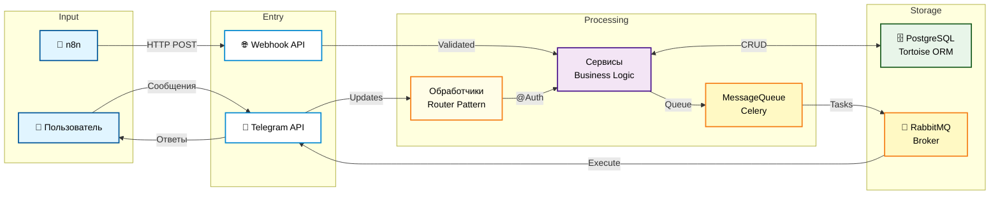

# telegram-n8n-bot

## Описание

Модульный Telegram-бот с интеграцией n8n для автоматизации рабочих процессов, управления опросами, штрафами и ролями пользователей. Проект построен на трехслойной архитектуре с четким разделением обязанностей: обработчики событий (handlers), бизнес-логика (services) и модели данных (models). Поддерживает как polling-режим для разработки, так и webhook-режим для production с использованием Docker и Traefik для SSL.

> **Заметка:** Чат-бот создавался для русскоговорящих пользователей. Вся документация на английском, но интерфейс чат-бота на русском языке.

## Технологический стек проекта

### Backend и Bot Framework
- **Bot Framework:** [aiogram 3.22](https://docs.aiogram.dev/en/latest/) - Асинхронный фреймворк для Telegram Bot API
- **Web Framework:** [FastAPI 0.116](https://fastapi.tiangolo.com/) - Современный веб-фреймворк для Python с автоматической документацией
- **Task Queue:** [Celery 5.5](https://docs.celeryq.dev/en/stable/) - Распределенная очередь задач для асинхронной обработки

### База данных и ORM
- **Database:** [PostgreSQL 15](https://www.postgresql.org/) - Реляционная база данных
- **ORM:** [Tortoise ORM 0.25](https://tortoise.github.io/) - Асинхронный ORM для Python
- **Migrations:** [Aerich 0.9](https://github.com/tortoise/aerich) - Инструмент миграций для Tortoise ORM

### Инфраструктура и интеграции
- **Message Broker:** [RabbitMQ 3](https://www.rabbitmq.com/) - Брокер сообщений для Celery
- **Workflow Automation:** [n8n](https://n8n.io/) - Платформа автоматизации рабочих процессов
- **Reverse Proxy:** [Traefik 2.11](https://doc.traefik.io/traefik/) - Reverse proxy с автоматическим SSL (Let's Encrypt)
- **Containerization:** [Docker](https://www.docker.com/) с Docker Compose profiles (development/production)

### Конфигурация и утилиты
- **Configuration:** [pydantic-settings 2.10](https://docs.pydantic.dev/latest/concepts/pydantic_settings/) - Управление конфигурацией через вложенные модели
- **Validation:** [Pydantic 2.11](https://docs.pydantic.dev/) - Валидация данных и схемы
- **ASGI Server:** [Uvicorn 0.35](https://uvicorn.dev/) с uvloop для высокой производительности
- **Testing:** [pytest 8.4](https://docs.pytest.org/) с pytest-asyncio для тестирования асинхронного кода

## Архитектура проекта

Проект следует трехслойной архитектуре с четким разделением ответственности:

### 1. Entry Point (`main.py`)
- **Dual-mode startup:** Поддержка двух режимов запуска
  - `python main.py` - Polling режим (разработка)
  - `python main.py webhook` - Webhook режим (production)
- Инициализирует логирование с ротацией файлов в `logs/`
- Webhook-режим запускает FastAPI через uvicorn на порту 8000

### 2. Core Layers (Основные слои)

#### Обработчики (`app/handlers/`)
- **Паттерн:** aiogram Router с декораторами `@Auth`
- **Ответственность:** Обработка входящих событий от Telegram
- **Классы:**
  - `UserHandlers` - Команды для обычных пользователей
  - `AdminHandlers` - Команды для администраторов
  - `SystemHandlers` - Системные обработчики (ошибки, неизвестные команды)
- **Особенность:** Все обработчики используют `MessageQueueService` для отправки сообщений (никогда напрямую через bot)

#### Сервисы (`app/services/`)
- **Паттерн:** Статические методы (static methods only)
- **Ответственность:** Вся бизнес-логика приложения
- **Сервисы:**
  - `UserService` - Управление пользователями
  - `ChatService` - Управление чатами
  - `SurveyService` - Управление опросами
  - `PenaltyService` - Управление штрафами
  - `MessageQueueService` - Очередь сообщений (интерфейс к Celery)
- **Особенность:** Никаких методов экземпляра, только статические методы

#### Модели (`app/models/`)
- **Паттерн:** Tortoise ORM с `@property` helpers
- **Ответственность:** Модели данных и связи между таблицами
- **Модели:**
  - `User` - Пользователи с ролями (USER, ADMIN, CREATOR)
  - `Chat` - Telegram чаты
  - `Survey` - Опросы
  - `SurveyTemplate` - Шаблоны опросов
  - `Penalty` - Штрафы
- **Особенность:** Используют `@property` для вычисляемых полей (например, `user.is_admin`)

### 3. Integration Layer (Слой интеграций)

#### FastAPI Webhooks (`app/api_fastapi/`)
- **n8n webhooks:** Эндпоинты в `routers/n8n_webhook.py`
- **Безопасность:** Валидация через заголовок `X-N8N-Secret-Token`
- **Dependency Injection:** Использует FastAPI Depends для внедрения зависимостей

#### Celery Tasks (`app/celery_tasks/`)
- **telegram_tasks.py:** Асинхронная отправка сообщений
- **Обработка ошибок:** TelegramRetryAfter с экспоненциальной задержкой
- **Устойчивость:** Автоматический retry до 5 попыток при сетевых ошибках

### 4. Configuration (`config/`)
- **settings.py:** Вложенные pydantic-модели (AppSettings.telegram, .database, .rabbitmq, .n8n)
- **tortoise_config.py:** Конфигурация Tortoise ORM и регистрация моделей
- **Переменные окружения:** Используют двойное подчеркивание для вложенности (например, `TELEGRAM__BOT_TOKEN`)

### 5. Decorators (`app/decorators/`)
- **auth.py:** Декораторы аутентификации и авторизации
  - `@Auth.required_user_registration` - Проверка регистрации пользователя
  - `@Auth.required_chat_bind` - Проверка привязки чата
  - `@Auth.required_not_private_chat` - Проверка типа чата
- **Особенность:** Декораторы можно стекировать для комбинации проверок

## Архитектурная диаграмма

## Быстрый запуск

### Предварительные требования

- Docker и Docker Compose
- Python 3.13+ (для локальной разработки)
- Make (опционально, для удобства)

### 1. Клонирование репозитория

```bash
git clone <repository-url>
cd telegramBot_n8n
```

### 2. Настройка окружения

```bash
# Создание .env файла из шаблона
make env
# или
cp env.example .env
```

После создания отредактируйте `.env` файл, замените переменные своими данными.


### 3. Режимы запуска

#### Development Mode (Polling)

Изолированная среда для разработки с отдельной БД и polling-режимом:

```bash
# Запуск всех dev-сервисов
make dev-up

# Просмотр логов
docker compose --profile development logs -f

# Остановка
make dev-down
```

**Включает:**
- Bot в polling-режиме
- Изолированную PostgreSQL (порт 5433)
- RabbitMQ для очереди задач
- Celery Worker

#### Production Mode (Webhook)

Полный production stack с Traefik, SSL и n8n:

```bash
# Сборка образов
make build

# Запуск production-сервисов
make up

# Просмотр логов
docker compose --profile production logs -f

# Остановка
make down
```

**Включает:**
- Traefik (reverse proxy + SSL)
- FastAPI в webhook-режиме
- PostgreSQL production
- RabbitMQ
- Celery Worker
- n8n для автоматизации

**Доступные URLs (production):**
- Telegram Bot webhook: `https://your-domain.com/webhook`
- n8n: `https://n8n.your-domain.com` (Basic Auth)
- Traefik Dashboard: `https://traefik.your-domain.com` (Basic Auth)
- RabbitMQ Management: `http://localhost:15672`

### 4. Полезные команды

```bash
# Просмотр всех доступных команд
make help

# Пересборка контейнеров
make build         # production
make dev-build     # development

# Подключение к БД
docker exec -it postgresql psql -U telegram_n8n_db

# Просмотр логов конкретного сервиса
docker compose logs -f api           # FastAPI
docker compose logs -f celery_worker # Celery
docker compose logs -f n8n           # n8n

# Очистка неиспользуемых Docker ресурсов
docker system prune -a --volumes
```

## Основные паттерны

### 1. Регистрация Обработчиков

Все обработчики используют aiogram Router pattern с декораторами:

```python
# app/handlers/user_handlers.py
class UserHandlers:
    def __init__(self):
        self.router = Router()
        self.user_service = UserService()
        self.message_queue_service = MessageQueueService()
        self._register_handlers()
    
    def _register_handlers(self):
        # Регистрация команд через декораторы методов
        self.router.message(CommandStart())(self.start_command)
        self.router.message(Command('profile'))(self.profile_command)
    
    @Auth.required_user_registration  # Декоратор проверки регистрации
    async def profile_command(self, message: Message):
        user = await self.user_service.get_user_by_telegram_id(message.from_user.id)
        # Бизнес-логика здесь
```

**Правила:**
- Классы обработчиков имеют атрибут `router: Router`
- Сервисы инстанцируются в `__init__`, но используют static methods
- Регистрация в `_register_handlers()` через декораторы методов
- Никогда не используйте `message.answer()` напрямую - только через `MessageQueueService`

### 2. Слой Сервисов (Только статические методы)

```python
# app/services/user_service.py
class UserService:
    @staticmethod
    async def get_user_by_telegram_id(telegram_id: int) -> User | None:
        """Получить пользователя по Telegram ID"""
        return await User.filter(telegram_id=telegram_id).first()
    
    @staticmethod
    async def create_user(
        telegram_id: int, 
        callsign: str, 
        role: UserRole = UserRole.USER
    ) -> User:
        """Создать нового пользователя"""
        return await User.create(
            telegram_id=telegram_id,
            callsign=callsign,
            role=role
        )
    
    @staticmethod
    async def update_user_role(user_id: int, new_role: UserRole) -> User:
        """Обновить роль пользователя"""
        user = await User.get(id=user_id)
        user.role = new_role
        await user.save()
        return user
```

**Правила:**
- Все методы - `@staticmethod`
- Полная типизация (параметры и возвращаемые значения)
- Используют Tortoise ORM для работы с БД
- Никакой логики отправки сообщений (только через MessageQueueService)

### 3. Паттерн Свойств Моделей

```python
# app/models/user.py
from tortoise import fields, Model
from enum import Enum

class UserRole(str, Enum):
    USER = 'user'
    ADMIN = 'admin'
    CREATOR = 'creator'

class User(Model):
    id = fields.IntField(pk=True)
    telegram_id = fields.BigIntField(unique=True)
    callsign = fields.CharField(max_length=255)
    role = fields.CharEnumField(UserRole, default=UserRole.USER)
    reserved = fields.BooleanField(default=False)
    created_at = fields.DatetimeField(auto_now_add=True)
    
    # Computed properties
    @property
    def is_admin(self) -> bool:
        """Проверка, является ли пользователь администратором"""
        return self.role in [UserRole.ADMIN, UserRole.CREATOR]
    
    @property
    def is_creator(self) -> bool:
        """Проверка, является ли пользователь создателем"""
        return self.role == UserRole.CREATOR
    
    @property
    def display_name(self) -> str:
        """Отображаемое имя пользователя"""
        return f'{self.callsign} (#{self.telegram_id})'
    
    class Meta:
        table = 'users'
```

**Правила:**
- Используйте `@property` для вычисляемых полей
- Никогда не изменяйте состояние в property getters
- Enum для полей с фиксированным набором значений
- Meta класс для настройки таблицы

### 4. Накладывание Декораторов (Auth)

```python
# app/handlers/admin_handlers.py
@Auth.required_user_registration     # 1. Проверка существования пользователя
@Auth.required_admin                 # 2. Проверка админских прав
@Auth.required_not_private_chat      # 3. Проверка типа чата
async def admin_command(self, message: Message):
    # Все проверки пройдены
    user = await self.user_service.get_user_by_telegram_id(message.from_user.id)
    # ... логика команды
```

**Доступные декораторы:**
- `@Auth.required_user_registration` - Пользователь зарегистрирован в БД
- `@Auth.required_admin` - Пользователь имеет роль ADMIN или CREATOR
- `@Auth.required_creator` - Пользователь имеет роль CREATOR
- `@Auth.required_chat_bind` - Чат привязан к боту
- `@Auth.required_not_private_chat` - Команда не в личных сообщениях

**Правила:**
- Декораторы применяются снизу вверх (от специфичных к общим)
- При провале проверки отправляется русское сообщение об ошибке через MessageQueueService
- Handler возвращает `None` и прекращает выполнение

### 5. Message Sending через Celery

**КРИТИЧЕСКИ ВАЖНО:** Никогда не используйте `bot.send_message()` или `message.answer()` напрямую!

```python
# ❌ НЕПРАВИЛЬНО
await message.answer('Привет!')
await bot.send_message(chat_id=123, text='Привет!')

# ✅ ПРАВИЛЬНО
from app.services import MessageQueueService

mqs = MessageQueueService()
await mqs.send_message(
    chat_id=message.chat.id,
    text='Привет!',
    parse_mode='Markdown'
)
```

**Преимущества:**
- Асинхронная отправка не блокирует handler
- Автоматический retry при ошибках (до 5 попыток)
- Обработка rate limits от Telegram (TelegramRetryAfter)
- Экспоненциальная задержка при сетевых ошибках
- Логирование всех ошибок

### 6. Паттерн Конфигурации

```python
# config/settings.py
from pydantic import Field
from pydantic_settings import BaseSettings, SettingsConfigDict

class TelegramSettings(BaseSettings):
    bot_token: str = Field(..., alias='TELEGRAM__BOT_TOKEN')
    creator_id: int = Field(..., alias='TELEGRAM__CREATOR_ID')
    webhook_url: str = Field('', alias='TELEGRAM__WEBHOOK_URL')
    webhook_secret: str = Field('', alias='TELEGRAM__WEBHOOK_SECRET')

class DatabaseSettings(BaseSettings):
    host: str = Field('localhost', alias='DATABASE__HOST')
    port: int = Field(5432, alias='DATABASE__PORT')
    user: str = Field(..., alias='DATABASE__USER')
    password: str = Field(..., alias='DATABASE__PASSWORD')
    basename: str = Field(..., alias='DATABASE__BASENAME')
    
    @property
    def url(self) -> str:
        """Constructs database URL"""
        return f'postgres://{self.user}:{self.password}@{self.host}:{self.port}/{self.basename}'

class AppSettings(BaseSettings):
    telegram: TelegramSettings = Field(default_factory=TelegramSettings)
    database: DatabaseSettings = Field(default_factory=DatabaseSettings)
    # ... другие вложенные настройки
    
    model_config = SettingsConfigDict(
        env_file='.env',
        env_file_encoding='utf-8',
        case_sensitive=False
    )

# Singleton instance
settings = AppSettings()
```

**Использование:**
```python
from config import settings

bot_token = settings.telegram.bot_token
db_url = settings.database.url  # Property с логикой
```

**Переменные окружения:**
```env
TELEGRAM__BOT_TOKEN=123:ABC
DATABASE__HOST=localhost
DATABASE__PORT=5432
```

### 7. Docker Compose Profiles

```yaml
# docker-compose.yml
services:
  postgres:
    image: postgres:15
    profiles: [production]  # Только в production
    
  postgres_dev:
    image: postgres:15
    profiles: [development]  # Только в development
    ports:
      - "5433:5432"  # Не конфликтует с production
    
  rabbitmq:
    image: rabbitmq:3-management
    profiles: [production, development]  # В обоих режимах
```

**Команды:**
```bash
# Запуск только production сервисов
docker compose --profile production up -d

# Запуск только development сервисов
docker compose --profile development up -d
```

## Структура кода
```
telegramBot_n8n/
├── main.py                      # Entry point: запуск polling/webhook
├── requirements.txt             # Python dependencies
├── pyproject.toml               # Poetry config + aerich settings
├── Dockerfile                   # Multi-stage build
├── docker-compose.yml           # Production + Development profiles
├── Makefile                     # Shortcuts для Docker команд
├── .env                         # Environment variables (НЕ в Git!)
├── env.example                  # Шаблон для .env
│
├── app/
│   ├── __init__.py
│   ├── celery_app.py            # Celery application setup
│   │
│   ├── bot_telegram/
│   │   ├── __init__.py
│   │   ├── main.py              # BotManager class
│   │   ├── database.py          # DB init/close functions
│   │   └── logging.py           # Logging setup с ротацией
│   │
│   ├── handlers/                # Обработчики событий Telegram
│   │   ├── __init__.py
│   │   ├── user_handlers.py     # Команды для пользователей
│   │   ├── admin_handlers.py    # Команды для админов
│   │   └── system_handlers.py   # Системные обработчики (ошибки)
│   │
│   ├── services/                # Бизнес-логика (static methods)
│   │   ├── __init__.py
│   │   ├── user_service.py
│   │   ├── chat_service.py
│   │   ├── survey_service.py
│   │   ├── penalty_service.py
│   │   ├── survey_template_service.py
│   │   └── message_queue_service.py
│   │
│   ├── models/                  # Tortoise ORM models
│   │   ├── __init__.py
│   │   ├── user.py
│   │   ├── chat.py
│   │   ├── survey.py
│   │   ├── survey_template.py
│   │   └── penalty.py
│   │
│   ├── schemas/                 # Pydantic schemas для валидации
│   │   └── __init__.py
│   │
│   ├── decorators/              # Декораторы аутентификации
│   │   ├── __init__.py
│   │   └── auth.py
│   │
│   ├── utils/                   # Вспомогательные утилиты
│   │   └── __init__.py
│   │
│   ├── celery_tasks/            # Celery tasks
│   │   ├── __init__.py
│   │   └── telegram_tasks.py    # send_telegram_message и др.
│   │
│   └── api_fastapi/             # FastAPI application
│       ├── __init__.py
│       ├── main.py              # FastAPI app с lifespan
│       ├── dependencies.py      # Dependency Injection helpers
│       ├── routers/
│       │   └── n8n_webhook.py   # n8n webhook endpoints
│       └── schemas/
│           └── n8n_schemas.py   # Pydantic schemas для n8n
│
├── config/
│   ├── __init__.py
│   ├── settings.py              # Pydantic Settings (вложенные модели)
│   └── tortoise_config.py       # Tortoise ORM config
│
├── migrations/                  # Aerich database migrations
│   └── models/
│       ├── 0_initial.sql
│       └── ...
│
├── scripts/
│   └── entrypoint.sh            # Docker entrypoint: migrations + start
│
├── logs/                        # Логи с ротацией (daily)
│   ├── telegram_bot.log.*
│   └── telegram_bot_error.log.*
│
├── tests/                       # Pytest tests
│   ├── __init__.py
│   ├── conftest.py              # Fixtures
│   ├── unit/                    # Unit tests
│   └── integration/             # Integration tests
│
├── n8n_data/                    # n8n persistent data (Docker volume)
├── n8n_workflows/               # Экспорт n8n workflows (JSON)
├── init-scripts/                # SQL initialization scripts
└── letsencrypt/                 # SSL certificates от Let's Encrypt
```

## Соглашения о стиле кода

- **Стиль импортов:** Абсолютные импорты внутри `app/`
  ```python
  from app.models import User  # ✅ Правильно
  from models import User      # ❌ Неправильно
  ```

- **Кавычки для строк:** Одинарные кавычки для строк
  ```python
  text = 'Привет!'  # ✅
  text = "Привет!"  # ❌
  ```

- **Типизация:** Полная типизация для Python 3.10+
  ```python
  async def get_users(limit: int = 10) -> list[User]:  # ✅
  async def get_users(limit=10):                       # ❌
  ```

- **Асинхронность везде:** Все DB запросы, API вызовы используют async/await
  ```python
  user = await User.get(id=1)              # ✅
  user = User.objects.get(id=1)            # ❌
  ```

- **Русские сообщения пользователям:** Все сообщения бота на русском, код/комментарии на английском
  ```python
  # ✅ Правильно
  async def send_greeting(user: User):
      """Send greeting message to user"""  # Docstring на английском
      text = f'Привет, {user.callsign}!'   # Текст для пользователя на русском
  ```

- **Логирование:** Используйте module logger с `traceback.format_exc()` для ошибок
  ```python
  import logging
  import traceback
  
  logger = logging.getLogger(__name__)
  
  try:
      await risky_operation()
  except Exception as e:
      logger.error('Failed to execute: %s\n%s', str(e), traceback.format_exc())
  ```

  ### Просмотр логов

```bash
# Логи приложения (ротация daily)
tail -f logs/telegram_bot.log
tail -f logs/telegram_bot_error.log

# Docker логи
docker compose logs -f api
docker compose logs -f celery_worker
docker compose logs -f rabbitmq
```

### Подключение к БД

```bash
# Production
docker exec -it postgresql psql -U telegram_n8n_db

# Development
docker exec -it postgresql_dev psql -U telegram_n8n_db

# Полезные SQL команды
\dt          # Список таблиц
\d users     # Структура таблицы users
SELECT * FROM users LIMIT 5;
```

## Вклад в проект

1. Форкните репозиторий
2. Создайте ветку для фичи (`git checkout -b feature/amazing-feature`)
3. Зафиксируйте изменения (`git commit -m 'Add amazing feature'`)
4. Отправьте в ветку (`git push origin feature/amazing-feature`)
5. Создайте Pull Request

**Чек-лист код-ревью:**
- [ ] Код следует соглашениям проекта (single quotes, typing, etc.)
- [ ] Все новые функции имеют docstrings
- [ ] Добавлены/обновлены тесты
- [ ] Логирование для критичных операций
- [ ] MessageQueueService для отправки сообщений
- [ ] .env.example обновлен если добавлены новые переменные

## Лицензия

[WTFPL](LICENSE.md)

## Контакты

**Проект поддерживает:** Максим VMSTR8 Винокуров   
**Email:** vinokurovmaxim@icloud.com    
**Telegram:** [VMSTR8](https://t.me/vmstr8)